# Plant Analysis Tool Pipeline

An end-to-end plant phenotyping library: load multi-band TIFFs or standard RGB images, build composites, segment plants with BRIA RMBG, extract texture / vegetation / morphology features, and write structured per-plant outputs.

---

## Table of Contents

1. [Overview](#overview)
2. [Repository Structure](#repository-structure)
3. [Installation](#installation)
4. [Quick Start](#quick-start)
5. [Running End-to-End with `python main.py`](#running-end-to-end-with-python-mainpy)
6. [Configuration](#configuration)
7. [Module 1 — Data (`data/`)](#module-1--data)
8. [Module 2 — Segmentation (`segmentation/`)](#module-2--segmentation)
9. [Module 3 — Detection (`detection/`)](#module-3--detection)
10. [Module 4 — Features (`features/`)](#module-4--features)
11. [Module 5 — Models (`models/`)](#module-5--models)
12. [Module 6 — Output (`output/`)](#module-6--output)
13. [Module 7 — Pipeline (`pipeline.py`)](#module-7--pipeline)
14. [Tools (`tools/`)](#tools)
15. [Output Structure](#output-structure)
16. [Dependencies](#dependencies)

---

## Overview

```
Multispectral TIF  (4-quadrant: Green / Red / Red-Edge / NIR)
  OR Standard RGB  (PNG / JPG — any camera)
        │
        ▼
┌─────────────────────┐
│   ImagePreprocessor  │  ── TIF: splits quadrants → RGB composite + spectral stack
└──────────┬──────────┘      RGB: loaded directly
           │
           ▼
┌──────────────────────────────────────┐
│         SegmentationManager          │
│  ┌─────────────────────────────────┐ │
│  │  BRIA RMBG-2.0 (default)        │ │  ── background removal model (HF)
│  │  SAM3 / text-prompted           │ │  ── segment-anything with text prompt
│  └─────────────────────────────────┘ │
│  + optional YOLO bounding-box crop   │
└──────────┬───────────────────────────┘
           │
    ┌──────┴───────────────────────────────┐
    │              │                       │
    ▼              ▼                       ▼
┌──────────┐  ┌──────────────┐  ┌─────────────────┐
│ Texture  │  │  Vegetation  │  │  Morphology      │
│ Features │  │  Indices     │  │  Features        │
│ LBP, HOG │  │  NDVI, NDRE  │  │  area, height,   │
│ Lacun.,  │  │  MCARI, MTVI │  │  skeleton, leaf  │
│ EHD, GLCM│  │  + RGB idxs  │  │  count, shape    │
└────┬─────┘  └──────┬───────┘  └────────┬─────────┘
     │                │                   │
     └────────────────┴───────────────────┘
                      │
                      ▼
             ┌─────────────────┐
             │  OutputManager  │
             │  PNG + JSON     │
             │  per plant/date │
             └─────────────────┘
```

---

## Example: Input → Output

### Multispectral TIF Input

| Composite | Overlay |
|:---------:|:-------:|
| 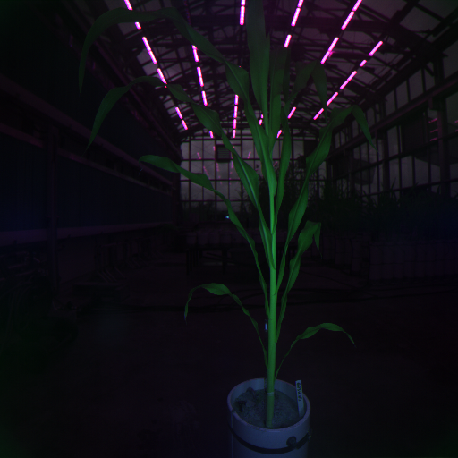 | 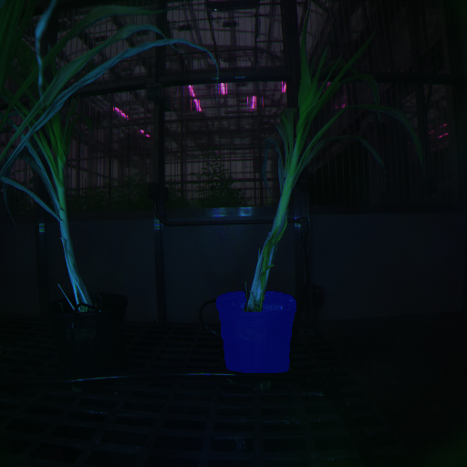 |

| Vegetation Index (NDVI) | Texture (LBP) |
|:-----------------------:|:-------------:|
| 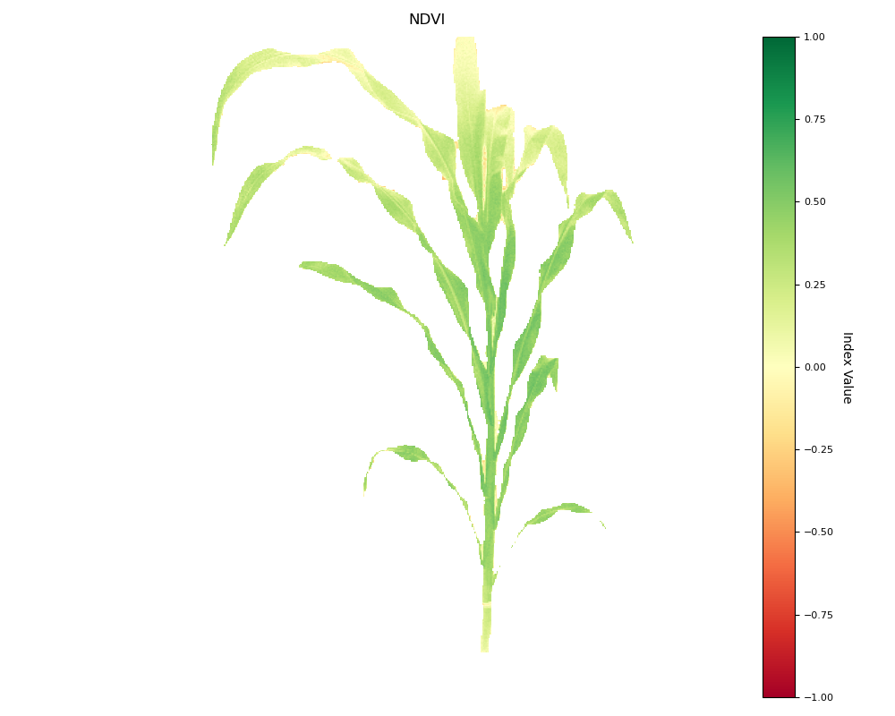 | 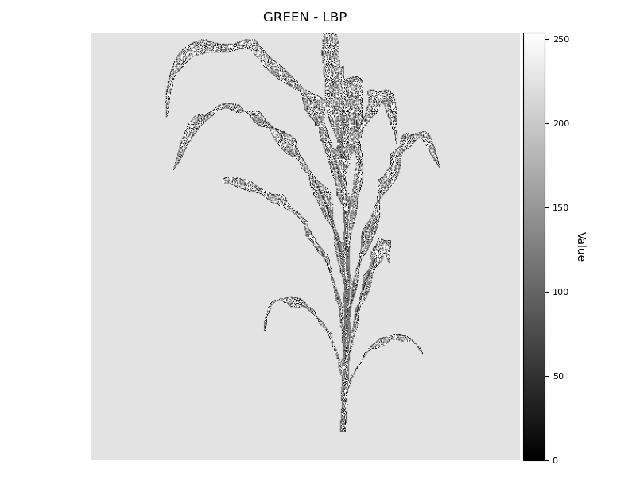 |

#### Extracted Features — Multispectral TIF

> Full CSVs: [`features_vegetation_indices.csv`](examples/features_vegetation_indices.csv) · [`features_texture.csv`](examples/features_texture.csv) · [`features_morphology.csv`](examples/features_morphology.csv)

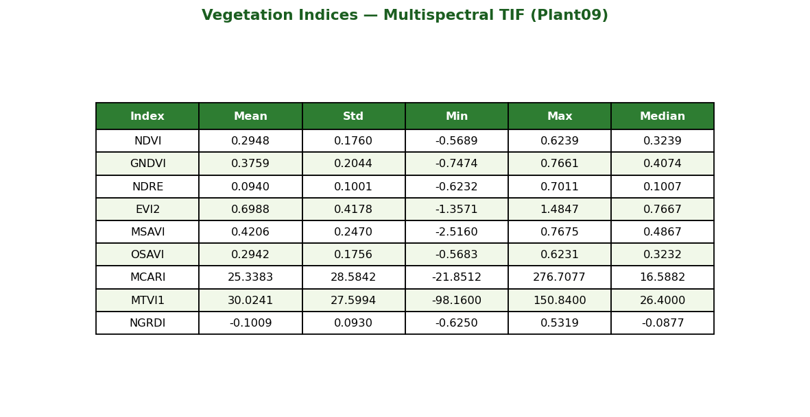

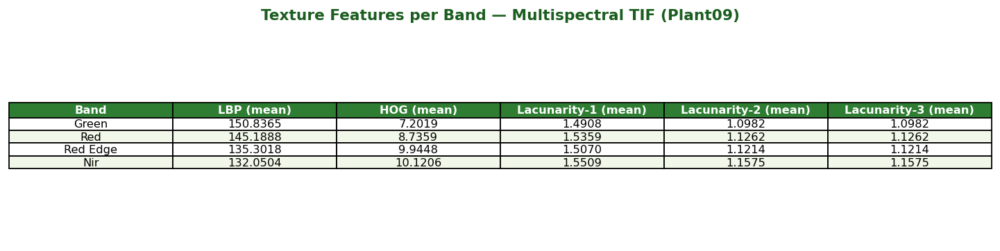

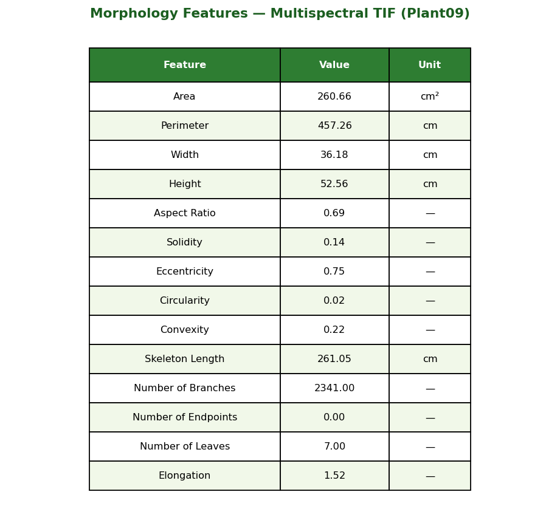

---

### RGB Input

| Composite | Overlay |
|:---------:|:-------:|
| 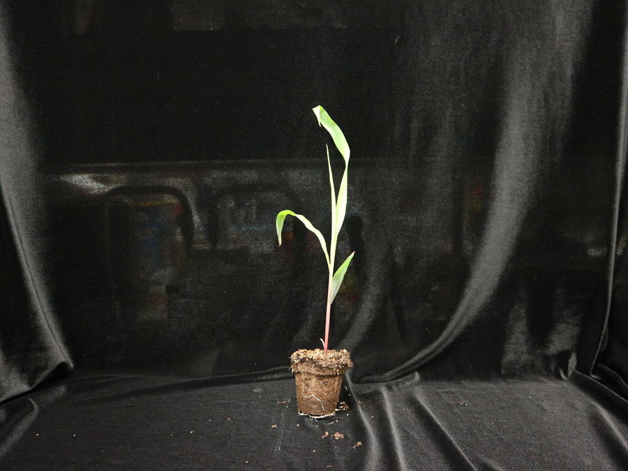 | 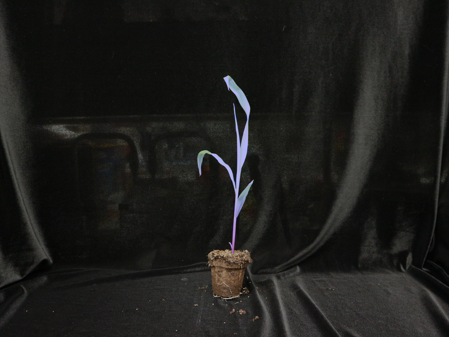 |

| Vegetation Index (NGRDI) | Texture (LBP) | Morphology (Skeleton) |
|:------------------------:|:-------------:|:---------------------:|
| 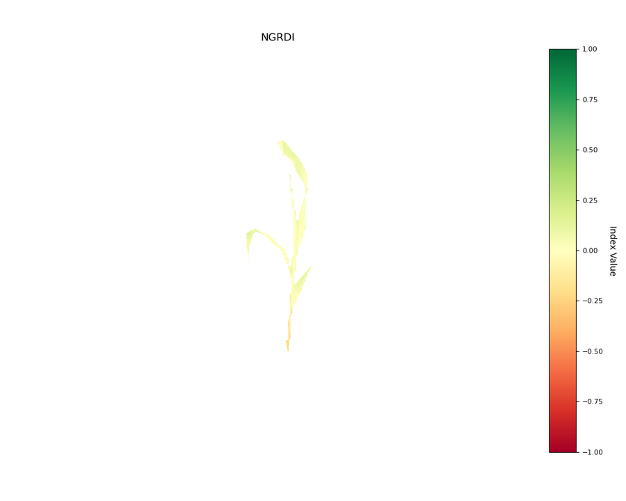 | 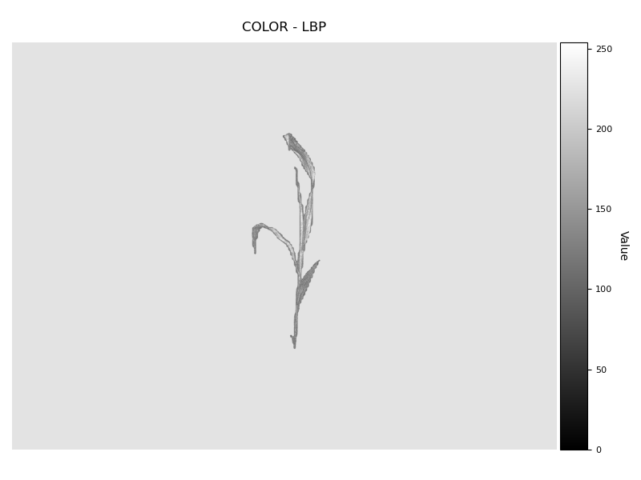 | 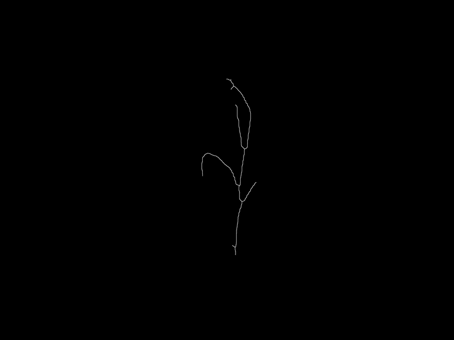 |

---

## Repository Structure

```
Plant_Analysis_Tool_Pipeline/
├── main.py                   # CLI entry point — run with `python main.py --config config.yaml`
├── pipeline.py               # SorghumPipeline — main orchestrator
├── config.py                 # Config dataclass + YAML I/O
├── __init__.py               # Public API exports
├── examples/
│   ├── inputs/
│   │   ├── multispectral_plant.tif   # Example 4-band multispectral TIF input
│   │   └── rgb_plant.png             # Example standard RGB input
│   └── sample_outputs/
│       ├── tif_output/               # Pipeline outputs for the TIF example
│       │   ├── composite.png         # RGB composite built from bands
│       │   ├── mask.png              # Segmentation mask
│       │   ├── overlay.png           # Mask overlaid on composite
│       │   ├── ndvi.png              # NDVI vegetation index heatmap
│       │   └── skeleton.png          # Morphology skeleton overlay
│       └── rgb_output/               # Pipeline outputs for the RGB example
│           ├── composite.png         # RGB composite (pass-through)
│           ├── mask.png              # Segmentation mask
│           ├── overlay.png           # Mask overlaid on composite
│           └── ngrdi.png             # NGRDI vegetation index (RGB-compatible)
├── data/
│   ├── loader.py             # DataLoader — discover date/plant/frame TIFFs
│   ├── preprocessor.py       # ImagePreprocessor — split 4-band TIFF → composite
│   │                         #                     or load standard RGB directly
│   └── mask_handler.py       # MaskHandler — mask morphology, filtering, overlays
├── segmentation/
│   └── manager.py            # SegmentationManager — BRIA RMBG inference
├── detection/
│   └── yolo_detector.py      # YOLODetector — optional pre-segmentation crop
├── features/
│   ├── texture.py            # TextureExtractor — LBP, HOG, Lacunarity, EHD
│   ├── vegetation.py         # VegetationIndexExtractor — NDVI, NDRE, MCARI…
│   ├── morphology.py         # MorphologyExtractor — PlantCV / OpenCV shape traits
│   └── spectral.py           # SpectralExtractor — band stats, PCA, spectral indices
├── models/
│   └── dbc_lacunarity.py     # DBC_Lacunarity — PyTorch lacunarity module
├── output/
│   └── manager.py            # OutputManager — per-plant folder + JSON/PNG writer
├── tools/
│   ├── organize_recording_tiffs.py          # Sort raw TIFFs into date/plant tree
│   ├── stack_tiffs_to_multipage.py          # Stack many TIFFs into one file
│   ├── copy_original_composites.py          # Mirror composite PNGs to new root
│   ├── sam3_batch_segment.py                # Batch SAM3 text-prompt segmentation
│   ├── realesrgan_upscale_composites.py     # Upscale composites (ncnn-vulkan)
│   ├── realesrgan_upscale_composites_torch.py # Upscale composites (PyTorch)
│   ├── feature_correlation_heatmap.py       # Feature correlation heatmap plot
│   └── rgb_input_pose/
│       ├── prepare_rgb_input_pose_dataset.py # Convert GT JSON → YOLO-Pose dataset
│       ├── predict_plant_keypoints.py        # Run pose model, output keypoint JSON
│       └── README.md
└── annotations/
    └── instances_default.json  # COCO-style instance annotations (plant class)
                                 # (large file — not tracked by git, see .gitignore)
```

---

## Installation

```bash
# 1. Clone the repository
git clone https://github.com/Advanced-Vision-and-Learning-Lab/Plant_Analysis_Tool_Pipeline.git
cd Plant_Analysis_Tool_Pipeline

# 2. Create and activate a virtual environment
python3 -m venv .venv
source .venv/bin/activate

# 3. Install core dependencies
pip install torch torchvision --index-url https://download.pytorch.org/whl/cu118
pip install transformers pillow numpy scipy scikit-image scikit-learn
pip install opencv-python matplotlib pandas pyyaml tqdm

# 4. Optional — morphology skeleton support
pip install plantcv

# 5. Optional — YOLO detection
pip install ultralytics
```

A Hugging Face token is required to download the BRIA RMBG segmentation model. Set it as an environment variable:

```bash
export HUGGINGFACE_TOKEN="hf_your_token_here"
```

---

## Quick Start

```python
from pipeline import PlantPipeline

results = PlantPipeline("config.yaml").run()
```

Or use the convenience wrapper:

```python
from pipeline import run_pipeline

results = run_pipeline(
    config_path="config.yaml",
    load_all_frames=False,   # process selected frames only
    segmentation_only=False, # also extract features
)
```

---

## Running End-to-End with `python main.py`

`main.py` is the recommended way to run the full pipeline from the command line. It loads your config, runs every stage, prints a summary, and saves a `run_summary.json` next to the results.

### Minimal run

```bash
python main.py --config config.yaml
```

All outputs (PNG images, JSON feature files, run log, summary) are written to the `output_folder` defined in your config.

---

### Command-line reference

```
usage: python main.py [--config PATH] [--input DIR] [--output DIR]
                      [--all-frames] [--segmentation-only]
                      [--plants PLANT [PLANT ...]]
                      [--frames FRAME [FRAME ...]]
                      [--force-reprocess] [--device DEVICE]
                      [--summary PATH] [--verbose]
```

| Flag | Short | Default | Description |
|------|-------|---------|-------------|
| `--config` | `-c` | `config.yaml` | Path to the YAML configuration file |
| `--input` | `-i` | *(from config)* | Override `paths.input_folder` |
| `--output` | `-o` | *(from config)* | Override `paths.output_folder` |
| `--all-frames` | | `False` | Process every frame per plant instead of selected frames only |
| `--segmentation-only` | | `False` | Stop after segmentation — skip texture, vegetation, and morphology extraction |
| `--plants` | | *(all)* | Process only the named plants, e.g. `--plants plant1 plant2` |
| `--frames` | | *(all)* | Process only specific frame numbers, e.g. `--frames 8 9` |
| `--force-reprocess` | | `False` | Reprocess even if outputs already exist |
| `--device` | | *(auto)* | Override compute device: `cuda` or `cpu` |
| `--summary` | | `<output>/run_summary.json` | Custom path for the JSON run summary |
| `--verbose` | `-v` | `False` | Enable DEBUG-level logging |

---

### Common examples

```bash
# Override both input and output paths without editing config.yaml
python main.py --config config.yaml \
    --input /data/raw_plants \
    --output /results/experiment_01

# Process all frames (not just the selected best frame)
python main.py --config config.yaml --all-frames

# Segmentation only — fastest pass, no feature extraction
python main.py --config config.yaml --segmentation-only

# Restrict to specific plants and a specific frame number
python main.py --config config.yaml --plants plant1 plant3 --frames 8

# Force a full rerun even if outputs already exist
python main.py --config config.yaml --force-reprocess

# Run on CPU (overrides config)
python main.py --config config.yaml --device cpu

# Save the run summary to a custom path
python main.py --config config.yaml --summary logs/run_2024_12_04.json
```

---

### Where results are saved

After a successful run every plant's outputs land under `output_folder`:

```
output_folder/
└── YYYY_MM_DD/
    └── plantN/
        ├── composite.png
        ├── mask.png
        ├── overlay.png
        ├── texture/
        │   ├── lbp.png
        │   ├── lacunarity.png
        │   └── texture_stats.json
        ├── vegetation_indices/
        │   ├── ndvi.png
        │   └── vi_stats.json
        ├── morphology/
        │   ├── skeleton.png
        │   └── morphology_stats.json
        └── metadata.json
run_summary.json          ← top-level summary for the whole run
sorghum_pipeline.log      ← full log file
```

`run_summary.json` contains total plant count, success/failure counts, elapsed time, and the resolved config paths — useful for experiment tracking.

---

## Configuration

Copy the example config and fill in your paths:

```bash
cp config.yaml.example config.yaml   # see below for structure
```

```yaml
paths:
  input_folder: "/path/to/dataset"    # parent of YYYY-MM-DD/plantN/ folders
  output_folder: "/path/to/results"
  yolo_weights: null                  # optional: /path/to/yolo.pt
  bbox_dir: null                      # optional: folder of per-plant bbox JSON

processing:
  device: "cuda"                      # "cuda" | "cpu" | null (auto-detect)
  max_plants: null                    # null = all plants
  max_frames: null

output:
  save_segmentation: true
  save_texture: true
  save_vegetation: true
  save_morphology: true
  save_metadata: true

model:
  segmentation_model: "briaai/RMBG-2.0"  # or "sam3" to use SAM3 backend
  text_prompt: "plant"                    # used only when segmentation_model: "sam3"
  yolo_model: "yolov8n.pt"
```

**`Config` class** (`config.py`) loads and validates this YAML into four typed dataclasses:

| Dataclass | Fields |
|-----------|--------|
| `Paths` | `input_folder`, `output_folder`, `yolo_weights`, `bbox_dir` |
| `ProcessingParams` | `device`, `max_plants`, `max_frames` |
| `OutputSettings` | `save_segmentation`, `save_texture`, `save_vegetation`, `save_morphology` |
| `ModelSettings` | `segmentation_model` (`"briaai/RMBG-2.0"` or `"sam3"`), `text_prompt`, `yolo_model` |

---

## Module 1 — Data

**Directory:** `data/`

### `loader.py` — DataLoader

Discovers and loads all plant TIF images from the dataset folder.

**Expected input folder layout:**
```
input_folder/
└── YYYY-MM-DD/
    └── plantN/
        ├── plantN_frame1.tif
        ├── plantN_frame2.tif
        └── ...
```

**Key methods:**

| Method | Description |
|--------|-------------|
| `load_selected_frames()` | Load only the best/configured frame per plant |
| `load_all_frames()` | Load every frame for every plant |
| `load_single_plant(plant_name)` | Load all frames for one specific plant |
| `load_bounding_boxes(bbox_dir)` | Load per-plant bounding boxes from LabelMe JSON |
| `load_hand_labels()` | Load placeholder hand-annotated labels |
| `validate_data(plants)` | Check loaded records for completeness |

Returns a dict keyed `YYYY_MM_DD_plantX_frameY` → `{"raw_image": PIL.Image, "plant_name", "file_path"}`.

Supports special loading rules:
- **`EXACT_FRAME`** — force a specific frame index for a plant.
- **`BORROW_FRAME`** — substitute a frame from another date if missing.
- **`FRAME_OVERRIDE_BY_NAME`** — override frame by plant name.
- **`PLANT_SUBSTITUTES_BY_NAME`** — replace a plant entry with another.

---

### `preprocessor.py` — ImagePreprocessor

Splits each 4-quadrant TIFF into spectral bands and builds an RGB composite.

**Step 1 — `process_raw_image(pil_img)`**

The input TIF is a single image composed of four quadrants:

```
┌──────────┬──────────┐
│  Green   │   Red    │
├──────────┼──────────┤
│ Red-Edge │   NIR    │
└──────────┴──────────┘
```

Each quadrant is extracted and registered independently, producing:
- `composite` — uint8 RGB image (Red, Green, Blue channels from Red, Green, Red-Edge).
- `spectral_stack` — dict with keys `green`, `red`, `red_edge`, `nir` (float32 arrays).

**Step 2 — `create_composites(plants)`**

Iterates over all loaded plant records and adds `composite` and `spectral_stack` to each.

---

### `mask_handler.py` — MaskHandler

Utility class for mask operations used throughout the pipeline.

| Method | Description |
|--------|-------------|
| `create_bounding_box_mask(shape, bbox)` | Binary mask inside a bounding box |
| `preprocess_mask(mask)` | Binarise, fill holes, remove noise |
| `keep_largest_component(mask)` | Retain only the largest connected component |
| `apply_mask_to_image(image, mask)` | Zero out background pixels |
| `get_mask_properties(mask)` | Area, centroid, bounding box stats |
| `validate_mask(mask, min_area)` | Check mask is non-trivial |
| `create_overlay(image, mask, color)` | Colored mask overlay on RGB image |

---

## Module 2 — Segmentation

**File:** `segmentation/manager.py` — `SegmentationManager`

Supports two segmentation backends that can be selected via config. Both produce a binary plant mask at the original image resolution.

---

### Backend A — BRIA RMBG-2.0 (default)

A dedicated background-removal model loaded from HuggingFace (`briaai/RMBG-2.0`). Best for clean greenhouse / studio images with a clear foreground plant.

**Steps:**

1. **Model loading** — `AutoModelForImageSegmentation` from `briaai/RMBG-2.0`; cached after first download.
2. **Preprocessing** — resize to model input size, normalize.
3. **Inference** — forward pass; output is a soft foreground probability map.
4. **Postprocessing** — threshold → binary mask, resize back to original resolution.

---

### Backend B — SAM3 (Segment Anything Model 3)

A text-prompted segmentation model loaded from HuggingFace (`facebook/sam3` or equivalent). Best for complex scenes with multiple plants, varied backgrounds, or when a natural-language prompt is needed to isolate the target plant.

**Steps:**

1. **Model loading** — `Sam3Model` + `Sam3Processor` from `transformers`; cached after first download.
2. **Text prompt** — e.g. `"plant"`, `"middle front plant"`, `"sorghum"` — controls which object is segmented.
3. **Inference** — processor encodes image + prompt; model outputs instance masks with confidence scores.
4. **Mask selection** — highest-confidence mask is selected; optional heuristics (largest, most-centered) applied for multi-instance scenes.
5. **Postprocessing** — threshold → binary mask, resize back to original resolution.

Enable SAM3 by setting `segmentation_model: "sam3"` in config, and provide a `text_prompt`.

---

### Shared Key Methods

| Method | Description |
|--------|-------------|
| `segment_image(image)` | Returns uint8 binary mask (0 / 255) using the configured backend |
| `segment_image_soft(image)` | Returns float [0, 1] probability mask |
| `post_process_mask(mask)` | Apply morphological cleanup (fill holes, remove small blobs) |
| `keep_largest_component(mask)` | Retain only the largest connected component |
| `validate_mask(mask)` | Reject masks below area threshold |
| `create_overlay(image, mask)` | Colored mask overlay for visualization |

**Input:** BGR `np.ndarray` (OpenCV format — converted internally to RGB for both models).  
**Output:** Binary mask same spatial size as input.

---

### Choosing a Backend

| Scenario | Recommended backend |
|----------|-------------------|
| Single plant, plain background | BRIA RMBG-2.0 |
| Multiple plants in frame | SAM3 with targeted text prompt |
| RGB photos, no depth cues | BRIA RMBG-2.0 |
| Multispectral composites | Either; SAM3 preferred for complex scenes |
| Need language-guided selection | SAM3 |

---

## Module 3 — Detection

**File:** `detection/yolo_detector.py` — `YOLODetector`

Optional YOLO-based detection step run **before** segmentation. Provides a tight bounding box crop so the segmentation model focuses on the correct plant, especially in multi-plant scenes.

### Steps

1. Run YOLO inference on the full composite image.
2. Prefer the class `"potted plant"` detection.
3. Track `"vase"` detections as exclusion regions (pot / container).
4. Return the best bounding box for the segmentation crop.

### Key Methods

| Method | Description |
|--------|-------------|
| `detect(image)` | Run YOLO; returns `boxes`, `scores`, `class_ids`, `largest_box`, `vase_boxes` |
| `get_crop_box(detections, image_shape)` | Compute final crop box with padding |

Enable YOLO by setting `yolo_weights` in config.

---

## Module 4 — Features

**Directory:** `features/`

All feature extractors accept a masked image region and return a nested statistics dict (mean, std, min, max, median, Q1, Q3) plus optional feature maps.

---

### `texture.py` — TextureExtractor

Applied to each spectral band independently after masking.

| Feature | Method | Description |
|---------|--------|-------------|
| **LBP** | `skimage.feature.local_binary_pattern` | Local Binary Pattern histogram (uniform, radius=3) |
| **HOG** | `skimage.feature.hog` | Histogram of Oriented Gradients (8 orientations, 8×8 cells) |
| **Lacunarity** | `DBC_Lacunarity` / box-counting | Multi-scale texture regularity (PyTorch module) |
| **EHD** | Custom edge histogram | Edge Histogram Descriptor (5 edge types over grid cells) |
| **GLCM** | `skimage.feature.grayscale_matrix` | Contrast, correlation, energy, homogeneity at 4 angles |

**Main method:** `extract_all_texture_features(band_image, mask)` → dict of all feature maps and statistics.

---

### `vegetation.py` — VegetationIndexExtractor

Computes per-pixel vegetation index maps and masked statistics.

**Multispectral indices (require NIR / Red-Edge):**

| Index | Formula |
|-------|---------|
| NDVI | (NIR − Red) / (NIR + Red) |
| GNDVI | (NIR − Green) / (NIR + Green) |
| NDRE | (NIR − RedEdge) / (NIR + RedEdge) |
| MSAVI | (2·NIR + 1 − √((2·NIR+1)² − 8·(NIR−Red))) / 2 |
| OSAVI | (NIR − Red) / (NIR + Red + 0.16) |
| EVI2 | 2.5 · (NIR − Red) / (NIR + 2.4·Red + 1) |
| MCARI | ((RedEdge − Red) − 0.2·(RedEdge − Green)) · (RedEdge/Red) |
| MTVI | 1.2·(1.2·(NIR − Green) − 2.5·(Red − Green)) |

**RGB-compatible indices (no NIR needed):**

| Index | Formula |
|-------|---------|
| ExG | 2G − R − B |
| VARI | (G − R) / (G + R − B) |
| GLI | (2G − R − B) / (2G + R + B) |
| NGRDI | (G − R) / (G + R) |
| RGBVI | (G² − R·B) / (G² + R·B) |

**Main method:** `compute_vegetation_indices(spectral_stack, mask)` → dict of index arrays and per-index statistics.

---

### `morphology.py` — MorphologyExtractor

Extracts plant shape traits using PlantCV (if installed) with OpenCV as fallback.

**Steps:**

1. **Contour analysis** (OpenCV) — area, perimeter, bounding box, convex hull.
2. **Ellipse fitting** — eccentricity, aspect ratio.
3. **Hu moments** — 7 rotation-invariant shape descriptors.
4. **PlantCV skeleton** (optional) — skeletonize mask → prune → identify branch/tip nodes → primary path length.
5. **Pixel → cm conversion** — via `pixel_to_cm` scale factor from config.

**Output traits:**

| Trait | Description |
|-------|-------------|
| `area_cm2` | Plant area in cm² |
| `perimeter_cm` | Perimeter length in cm |
| `height_cm` | Bounding box height in cm |
| `width_cm` | Bounding box width in cm |
| `aspect_ratio` | Height / width |
| `compactness` | 4π·Area / Perimeter² |
| `eccentricity` | From fitted ellipse |
| `solidity` | Area / convex hull area |
| `skeleton_length_cm` | Total skeleton length |
| `num_branch_points` | Branch point count |
| `num_endpoints` | Tip count (leaf count proxy) |
| `primary_path_length_cm` | Longest skeleton path (height proxy) |

---

### `spectral.py` — SpectralExtractor

Band-level statistics and dimensionality reduction.

| Feature group | Description |
|---------------|-------------|
| `band_features` | Mean, std, min, max per band (green, red, red_edge, nir) |
| `pca_features` | PCA on the 4-band stack; first 3 PC scores |
| `spectral_indices` | Compact index block (mirrors `vegetation.py`) |
| `spectral_texture` | Band-level texture statistics |

**Main method:** `extract_spectral_features(spectral_stack, mask)`.

---

## Module 5 — Models

**File:** `models/dbc_lacunarity.py` — `DBC_Lacunarity`

A PyTorch `nn.Module` implementing **Differential Box-Counting Lacunarity**, used by `TextureExtractor` for multi-scale texture regularity analysis.

```python
model = DBC_Lacunarity(min_box=2, max_box=32, num_scales=8)
lacunarity_map = model(image_tensor)  # [B, C, H, W] input
```

| Method | Description |
|--------|-------------|
| `forward(x)` | Compute lacunarity map tensor |
| `compute_lacunarity(x, box_size)` | Single-scale lacunarity |
| `get_model_info()` | Return config dict |

---

## Module 6 — Output

**File:** `output/manager.py` — `OutputManager`

Writes all per-plant results to a structured folder tree.

### Steps

1. **`create_output_directories()`** — create `output_folder/YYYY_MM_DD/plantN/` tree.
2. **`save_plant_results(plant_key, plant_data)`** — dispatch to all `_save_*` helpers.

### Saved files per plant

| File | Content |
|------|---------|
| `composite.png` | RGB composite image |
| `mask.png` | Binary segmentation mask |
| `overlay.png` | Mask overlay on composite |
| `texture/lbp.png` | LBP feature map |
| `texture/lacunarity.png` | Lacunarity map |
| `texture/texture_stats.json` | Texture statistics (all bands) |
| `vegetation_indices/ndvi.png` | NDVI heatmap |
| `vegetation_indices/vi_stats.json` | All index statistics |
| `morphology/skeleton.png` | Skeleton + branch overlay |
| `morphology/morphology_stats.json` | All shape traits |
| `metadata.json` | Plant key, date, frame, file path, timing |

---

## Module 7 — Pipeline

**File:** `pipeline.py` — `PlantPipeline`

The main orchestrator. Wires all modules together.

### `run()` — Full pipeline execution

```
run()
  ├── DataLoader.load_selected_frames()  (or load_all_frames)
  ├── ImagePreprocessor.create_composites()
  ├── [optional] YOLODetector.detect()
  ├── SegmentationManager.segment_image()
  ├── MaskHandler.preprocess_mask()
  ├── TextureExtractor.extract_all_texture_features()
  ├── VegetationIndexExtractor.compute_vegetation_indices()
  ├── MorphologyExtractor.extract_morphology_features()
  └── OutputManager.save_plant_results()
```

### `run()` arguments

| Argument | Default | Description |
|----------|---------|-------------|
| `load_all_frames` | `False` | Process all frames per plant |
| `segmentation_only` | `False` | Stop after segmentation (skip feature extraction) |
| `plant_filter` | `None` | Process only plants whose name contains this string |
| `frame_filter` | `None` | Process only a specific frame index |
| `force_reprocess` | `False` | Reprocess even if output already exists |
| `instance_segmentation` | `False` | Use SAM2Long for per-leaf instance masks |
| `reuse_mapping` | `None` | Path to existing instance mapping JSON |

### Return value

```python
{
    "plants": { ... },        # in-memory plant dicts with all features
    "summary": { ... },       # counts, timing, success/failure per plant
    "config": Config,
    "timing_seconds": float
}
```

Writes `plant_pipeline.log` next to the output folder.

---

## Tools

**Directory:** `tools/`

Standalone CLI scripts for dataset preparation and extended workflows.

---

### `organize_recording_tiffs.py`

Sort raw camera TIFFs from a recording session into the expected `YYYY-MM-DD/plantN/` folder layout.

```bash
python tools/organize_recording_tiffs.py \
  --tiff-root /path/to/raw_tiffs \
  --output-root /path/to/dataset
```

---

### `stack_tiffs_to_multipage.py`

Combine many single-page TIFFs into one multi-page TIFF file.

```bash
python tools/stack_tiffs_to_multipage.py \
  --input-dir /path/to/tiffs \
  --output stacked.tif
```

---

### `copy_original_composites.py`

Mirror `*_composite.png` files from a pipeline output tree to a new root, preserving relative paths.

```bash
python tools/copy_original_composites.py \
  --src-root /path/to/results \
  --dst-root /path/to/composites_only
```

---

### `sam3_batch_segment.py`

Batch SAM3 text-prompt segmentation on composite images. Use this as a standalone alternative to the BRIA backend when you need language-guided plant isolation across a folder of images.

```bash
python tools/sam3_batch_segment.py \
  --image-dir /path/to/composites \
  --output-dir /path/to/sam3_output \
  --prompt "plant"
```

Saves per image: `__sam3_mask.png`, masked cutout, overlay PNG, `stats.json`.

---

### `realesrgan_upscale_composites.py` / `realesrgan_upscale_composites_torch.py`

Upscale composite images 4× using Real-ESRGAN.

- `realesrgan_upscale_composites.py` — uses the portable ncnn-vulkan binary (auto-downloads).
- `realesrgan_upscale_composites_torch.py` — uses the PyTorch implementation.

```bash
python tools/realesrgan_upscale_composites.py
```

---

### `feature_correlation_heatmap.py`

Scan a pipeline output tree, collect all saved feature statistics, and render a correlation heatmap.

```bash
python tools/feature_correlation_heatmap.py \
  --output-root /path/to/results \
  --save-path correlation.png
```

---

### `tools/rgb_input_pose/`

Keypoint / pose estimation utilities for standard RGB input images.

#### `prepare_rgb_input_pose_dataset.py`

Converts a ground-truth keypoint annotation JSON into an Ultralytics YOLO-Pose training dataset.

```bash
python tools/rgb_input_pose/prepare_rgb_input_pose_dataset.py \
  --dataset-root /path/to/gt_dataset \
  --output-root /path/to/yolo_pose_dataset
```

Produces: `images/`, `labels/` (YOLO-Pose `.txt`), `leaf_status/`, `dataset.yaml`.

#### `predict_plant_keypoints.py`

Run a trained YOLO-Pose model on plant images to predict leaf tip keypoints.

```bash
python tools/rgb_input_pose/predict_plant_keypoints.py \
  --model /path/to/pose.pt \
  --images /path/to/plant_images \
  --out /path/to/predictions
```

Saves one JSON per image with predicted keypoints and confidence scores.

---

## Output Structure

```
output_folder/
└── YYYY_MM_DD/
    └── plantN/
        ├── composite.png
        ├── mask.png
        ├── overlay.png
        ├── texture/
        │   ├── lbp.png
        │   ├── lacunarity.png
        │   └── texture_stats.json
        ├── vegetation_indices/
        │   ├── ndvi.png
        │   └── vi_stats.json
        ├── morphology/
        │   ├── skeleton.png
        │   └── morphology_stats.json
        └── metadata.json
```

### `metadata.json`

```json
{
  "plant_key": "2024_12_04_plant1_frame8",
  "plant_name": "plant1",
  "date": "2024-12-04",
  "frame": 8,
  "file_path": "/path/to/plant1_frame8.tif",
  "processing_time_s": 3.42
}
```

---

## Dependencies

| Package | Purpose |
|---------|---------|
| `torch` + `torchvision` | BRIA and SAM3 model inference; DBC lacunarity |
| `transformers` | HuggingFace `AutoModelForImageSegmentation` (BRIA RMBG) and `Sam3Model` / `Sam3Processor` (SAM3) |
| `opencv-python` | Image I/O, contour analysis, morphological ops |
| `Pillow` | TIFF loading |
| `numpy` | Array operations |
| `scipy` | Skeleton analysis, signal processing |
| `scikit-image` | LBP, HOG, GLCM texture features |
| `scikit-learn` | PCA |
| `matplotlib` | Plots and heatmaps |
| `pandas` | Tabular aggregation |
| `pyyaml` | Config file parsing |
| `tqdm` | Progress bars |
| `plantcv` | (optional) PlantCV skeleton and morphology |
| `ultralytics` | (optional) YOLO detection / pose |
| `tifffile` | (tools) Multi-page TIFF stacking |

---

## Security

Never commit API tokens or credentials. Use environment variables:

```bash
export HUGGINGFACE_TOKEN="hf_your_token_here"
```

---

## Citation

If you use this pipeline in your research, please cite:

```bibtex
@article{orvati2026data,
  title={A Data-Driven Image Extraction and Analysis Pipeline for Plant Phenotyping in Controlled Environments},
  author={Orvati Nia, Fahimeh and Peeples, Joshua and Murray, Seth C and McFarland, Andrew and Vann, Troy and Salehi, Shima and Hardin, Robert and Baltensperger, David D and Ibrahim, Amir and Thomasson, J Alex and others},
  journal={bioRxiv},
  pages={2026--02},
  year={2026},
  publisher={Cold Spring Harbor Laboratory}
}
```
